# 用户操作指南 User Guide · Get Started in 5 Minutes

5 分钟把 NoviDesk 用到最顺手——从安装、呼出，到拖动换位、分屏、时光收纳，一步步带你走完。

Everything from install and summon to rearranging, split view and time-based filing — a complete walkthrough.

## 1. 安装与首次启动 Install &amp; First Launch

从微软应用商店下载最新安装包，双击按提示完成安装。首次启动时，应用会以默认设置出现在屏幕左下角，整个真实桌面保持干净——不占任务栏、不抢焦点。

Grab the latest installer from microsoft store Releases and follow the prompts. On first launch, the workspace appears at the bottom-left corner with default settings — no taskbar clutter, no stolen focus.

<blockquote>
  
Windows 首次运行时若出现 SmartScreen 提示，点「更多信息 → 仍要运行」即可。

  
If Windows SmartScreen appears on first run, choose "More info → Run anyway".

</blockquote>

## 2. 呼出与收起 Show &amp; Hide

把鼠标移到屏幕<b>左下角</b>，工作台从边缘平滑滑出（约 0.5 秒）；鼠标移开，自动收回。呼之即出、挥之即去，全程<b>零点击</b>，不需要任何快捷键。

Move your cursor to the <b>bottom-left corner</b> and the workspace glides out from the edge (~0.5s); move away and it retracts. Summoned and dismissed with zero clicks and no hotkeys.

<figure>
  
  <figcaption>鼠标移到角落 → 工作台从边缘滑出</figcaption>
</figure>

<h3>挑选你的触发角 Pick Your Hot Corner</h3>

默认是左下角。如果你换了手、或者接了多显示器，可以在<b>主菜单 → 触发角</b>里改。<b>每个屏幕的每一个角都能单独启用</b>——挑一个最不影响你日常操作的角落即可。

Bottom-left is the default. Switch it from <b>Main menu → Hot corner</b>. <b>Every corner on every monitor can be enabled independently</b> — pick one that never interferes with your flow.

<blockquote>
  
小技巧：多屏作业时给每块屏幕单独设角，鼠标在哪块屏都能就近呼出，多屏工作流互不打架。

  
Tip: with multiple monitors, set a corner per screen so the workspace is always within reach.

</blockquote>

## 3. 卡片面板与版面布局 Card Panels &amp; Layout

工作台默认是 <b>3×3 卡片网格</b>，每一格都是一个独立的文件夹面板，各自显示不同位置的内容。

The workspace is a <b>3×3 grid of card panels</b>, each an independent folder view showing a different location.

<h3>调整卡片位置 Rearrange Cards</h3>

按住一张卡片的<b>标题栏</b>，拖到另一张卡片上松手，两者<b>互换位置</b>——10 秒就能搭出属于你的专属版面。

Drag a card's <b>title bar</b> onto another card and release to <b>swap</b> them — build your custom layout in seconds.

<figure>
  
  <figcaption>3×3 卡片网格，拖动标题栏即可换位</figcaption>
</figure>

## 4. 把文件夹拖进卡片 Bind Folders to Cards

用资源管理器（文件管理器）把常用文件夹<b>直接拖到任意卡片</b>上，松手即完成绑定，该面板立刻显示这个文件夹的内容。

Drag any folder straight from Explorer onto a card and release — the panel immediately shows that folder.

也可以把文件夹拖到<b>设置卡</b>上绑定，再在菜单里切换「单文件夹 / 多文件夹聚合」（单选 / 多选），灵活掌控每个面板到底显示什么。

You can also drop folders onto the <b>Settings card</b>, then toggle single-folder or multi-folder aggregation (single/multi-select) from the menu to control exactly what each panel shows.

<figure>
  
  <figcaption>拖文件夹进设置卡，单选 / 多选自由切换</figcaption>
</figure>

## 5. 文件与文件夹操作 File &amp; Folder Operations

在卡片里操作文件，和用系统资源管理器几乎一模一样，所有 Shell 操作一键可达：

Working with files inside a card feels just like the native Explorer — every shell action is one gesture away:

<table>
  <thead>
    <tr><th>操作</th><th>结果</th></tr>
  </thead>
  <tbody>
    <tr><td>双击文件 / 文件夹</td><td>用系统默认程序打开</td></tr>
    <tr><td>右键文件</td><td>唤出系统原生 Explorer 菜单（复制 / 剪切 / 属性 / 打开方式……）</td></tr>
    <tr><td>把文件拖入卡片</td><td><b>复制</b></td></tr>
    <tr><td>把文件跨面板拖到另一张卡片</td><td><b>移动</b></td></tr>
  </tbody>
</table>

Double-click to open with the default app; right-click for the native Explorer menu; drag a file into a card to copy; drag across panels to move.

<figure>
  
  <figcaption>拖入 = 复制，跨面板拖拽 = 移动</figcaption>
</figure>

## 6. 一秒进入分屏 Instant Split View

在文件夹的<b>名称</b>上双击（注意：不是图标），即进入<b>左右分屏</b>——左侧导航、右侧预览，顶部显示当前相对路径。点左侧区域即可退出分屏。

Double-click a folder's <b>name</b> (not the icon) to enter a <b>side-by-side split</b> — navigate on the left, preview on the right, with the relative path shown on top. Click the left pane to exit.

<figure>
  
  <figcaption>双击文件夹名 → 左右分屏，点左侧退出</figcaption>
</figure>

## 7. 时光收纳 TimeCollect

新文件会自动按时间归集到对应的时间桶：<b>今天 / 昨天 / 前天 / 近七天 / 早些时候</b>，并且<b>实时刷新</b>。文件一落盘就能在对应分组里找到，再也不用手动建「2026-08」这类日期文件夹。

New files are auto-bucketed by time: <b>Today / Yesterday / 2 days ago / Last 7 days / Earlier</b>, refreshed live. Files show up in the right group the moment they land — no more hand-made date folders.

<figure>
  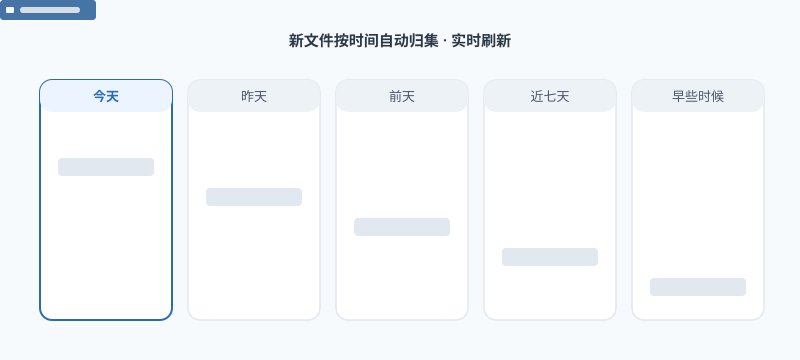
  <figcaption>文件按时间自动归集，无需手动建文件夹</figcaption>
</figure>

## 8. 主题与视图模式 Themes &amp; View Modes

在<b>主菜单</b>里一键切换<b>深色 / 浅色</b>主题，应用会<b>记住你的偏好</b>，下次启动保持一致。配合<b>大卡片 / 小卡片</b>视图模式，亮屏护眼、信息密度随心切换。

One tap in the <b>main menu</b> switches between <b>dark and light</b> themes and <b>remembers your choice</b> across restarts. Pair it with <b>large or small card</b> view modes for the density you want.

<figure>
  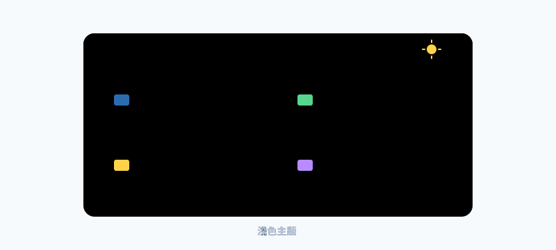
  <figcaption>深 / 浅主题一键切换并记忆</figcaption>
</figure>

## 9. 高频操作演示 Quick Demos

以下 8 段演示覆盖了日常最高频的操作，看一眼就会：

These eight demos cover the most frequent actions — one look is enough:

<ul class="tips">
  <li>
    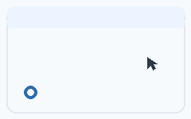
    <b>呼出 / 收起 · Show / Hide</b>
    
鼠标移到屏幕左下角，工作台自动滑出；移开自动隐藏——全程零点击，不占任务栏。

    
Hover the bottom-left corner to summon the workspace; move away and it hides — zero-click, no taskbar clutter.

  </li>
  <li>
    
    <b>卡片换位 · Rearrange Cards</b>
    
拖动面板标题栏即可与其它面板交换位置，10 秒搭出你的专属版面。

    
Drag a panel's title bar to swap it with another — build your own layout in seconds.

  </li>
  <li>
    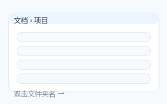
    <b>秒进分屏 · Instant Split View</b>
    
在文件夹名称上双击即进入左右分屏，左侧导航、右侧预览，再点左侧退出。

    
Double-click a folder name to enter a side-by-side split (navigate left, preview right); click the left pane to exit.

  </li>
  <li>
    
    <b>拖拽即复制 / 移动 · Drag to Copy / Move</b>
    
把文件拖进卡片即复制，跨面板拖拽即移动，免右键、免菜单。

    
Drag a file into a card to copy, or across panels to move — no right-click needed.

  </li>
  <li>
    
    <b>原生菜单 · Native Context Menu</b>
    
在文件上右键即唤出系统 Explorer 菜单，所有 Shell 操作一键可达。

    
Right-click any file for the native Explorer menu — every shell action, one gesture away.

  </li>
  <li>
    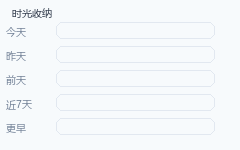
    <b>时光收纳 · TimeCollect</b>
    
新文件自动按「今天 / 昨天 / 前天 / 近七天 / 早些时候」归集，无需手动建日期文件夹。

    
New files auto-bucket into Today / Yesterday / 2 days ago / Last 7 days / Earlier — no manual date folders.

  </li>
  <li>
    
    <b>一键换肤 · One-tap Theming</b>
    
主菜单一键切换深 / 浅主题并记忆偏好，亮屏护眼随心。

    
One tap in the main menu switches dark / light themes and remembers your choice.

  </li>
  <li>
    
    <b>单选 / 多选 · Single / Multi Select</b>
    
设置面板切换单文件夹或多文件夹聚合，灵活掌控每个面板显示什么。

    
Toggle single-folder or multi-folder aggregation in settings to control exactly what each panel shows.

  </li>
</ul>

## 10. 快捷操作速查 Quick Reference

<figure>
  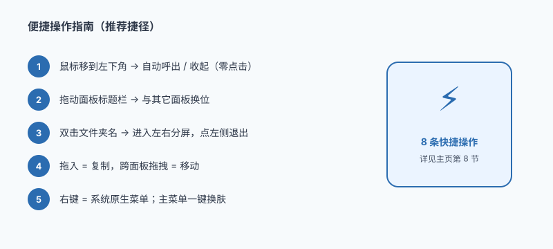
  <figcaption>把最常用的操作记成一张卡片</figcaption>
</figure>

<table>
  <thead>
    <tr><th>我想……</th><th>怎么做</th></tr>
  </thead>
  <tbody>
    <tr><td>呼出 / 收起工作台</td><td>鼠标移到触发角（默认屏幕左下角）/ 移开</td></tr>
    <tr><td>换一个触发角</td><td>主菜单 → 触发角（可逐屏、逐角设置）</td></tr>
    <tr><td>让面板显示某个文件夹</td><td>把文件夹从资源管理器拖到该卡片上</td></tr>
    <tr><td>调整卡片位置</td><td>拖动卡片<b>标题栏</b>到另一张卡片上互换</td></tr>
    <tr><td>进入左右分屏</td><td>双击文件夹<b>名称</b>（不是图标）</td></tr>
    <tr><td>复制文件到另一个面板</td><td>把文件拖入目标卡片</td></tr>
    <tr><td>把文件移动到另一个面板</td><td>把文件跨面板拖到目标卡片</td></tr>
    <tr><td>复制 / 剪切 / 改属性</td><td>在文件上右键，用系统原生菜单</td></tr>
    <tr><td>按时间找新文件</td><td>看「时光文件」分组：今天 / 昨天 / 前天 / 近七天 / 早些时候</td></tr>
    <tr><td>切换深 / 浅主题</td><td>主菜单 → 主题（自动记忆）</td></tr>
    <tr><td>调整信息密度</td><td>大卡片 / 小卡片视图模式</td></tr>
  </tbody>
</table>

## 11. 进阶玩法 Pro Tips

<ul class="tips">
  <li>
    <b>多触发角联动</b>
    
每个显示器单独设角，鼠标在哪块屏都能就近呼出，多屏工作流不打架。

    
Set a corner per monitor so the workspace is always within reach — multi-screen workflows stay clean.

  </li>
  <li>
    <b>拖拽方向决定复制还是移动</b>
    
拖到已有内容的卡片 = 复制到该文件夹；跨面板拖拽 = 移动文件位置。想清楚再松手。

    
Drop into an occupied card to copy; drag across panels to move. Decide before you release.

  </li>
  <li>
    <b>把设置卡当「聚合视图」用</b>
    
把多个常用文件夹都拖进设置卡并切到多文件夹模式，一张面板同时盯住几处内容。

    
Bind several folders to the Settings card in multi-folder mode to watch multiple locations from a single panel.

  </li>
  <li>
    <b>分屏当「整理台」用</b>
    
左屏浏览来源、右屏预览内容，边看边决定去留，比来回开窗口高效得多。

    
Browse on the left, preview on the right — triage files without juggling windows.

  </li>
  <li>
    <b>离线激活 Pro</b>
    
Pro 通过离线激活码开启，不连接任何服务器，隐私零外泄。激活步骤详见 <a href="{{ '/activate/' | relative_url }}">激活与订阅</a>。

    
Pro unlocks via an offline activation code — no server contact, nothing leaves your machine. See <a href="{{ '/activate/' | relative_url }}">Activation</a> for the steps.

  </li>
</ul>

想先看完整功能亮点，可回到 <a href="{{ '/' | relative_url }}">产品主页</a>；准备解锁全部能力，请前往 <a href="{{ '/buy/' | relative_url }}">升级 Pro</a>。

For the full feature overview head back to the <a href="{{ '/' | relative_url }}">Overview</a>, or continue to <a href="{{ '/buy/' | relative_url }}">Upgrade to Pro</a>.

